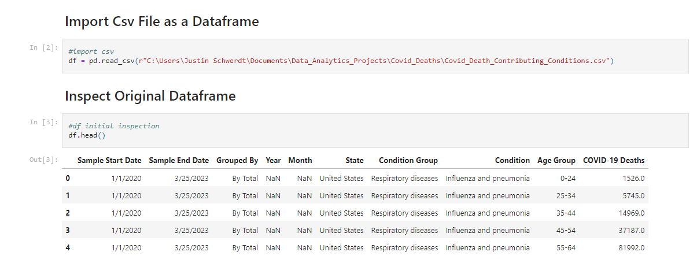
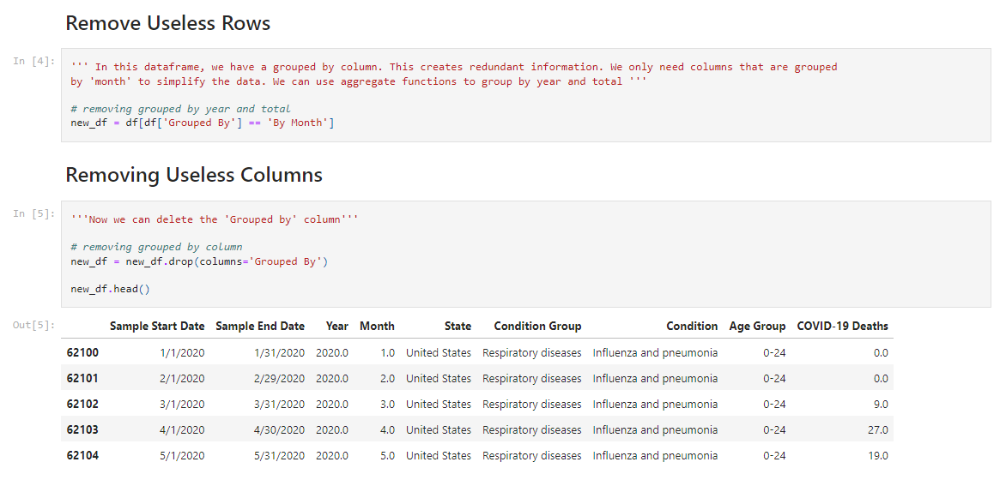
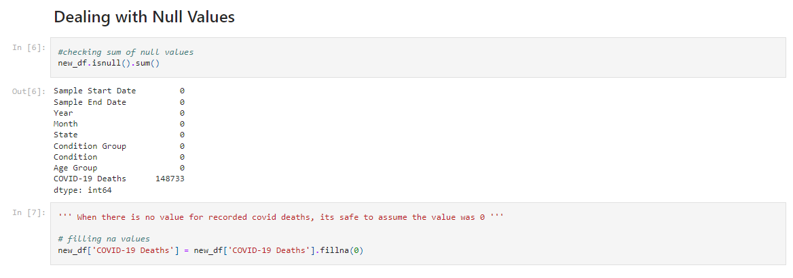
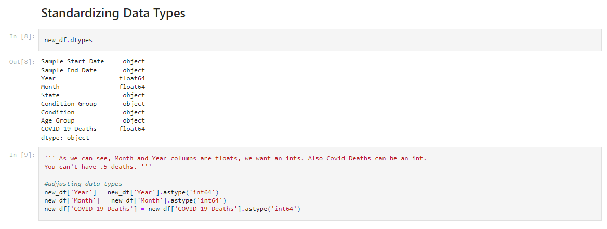
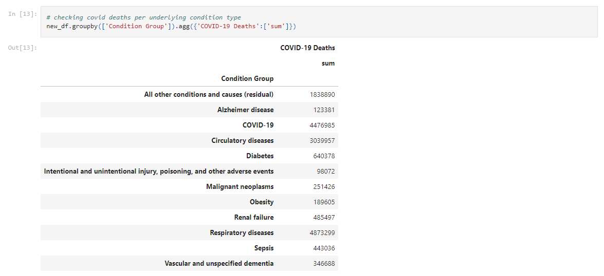
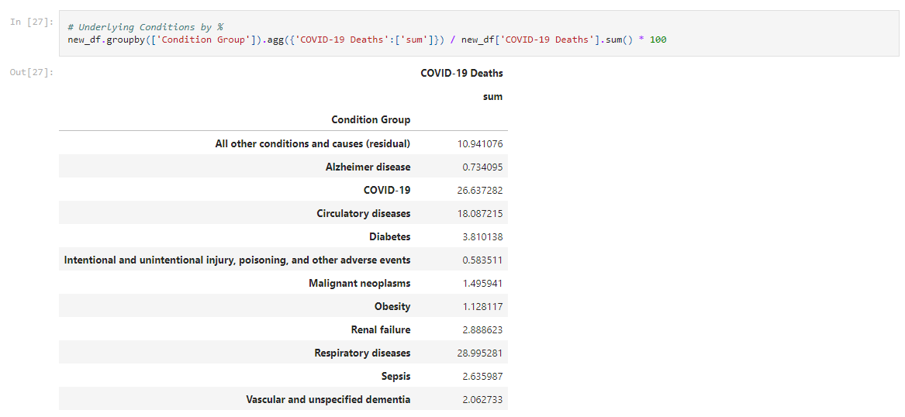
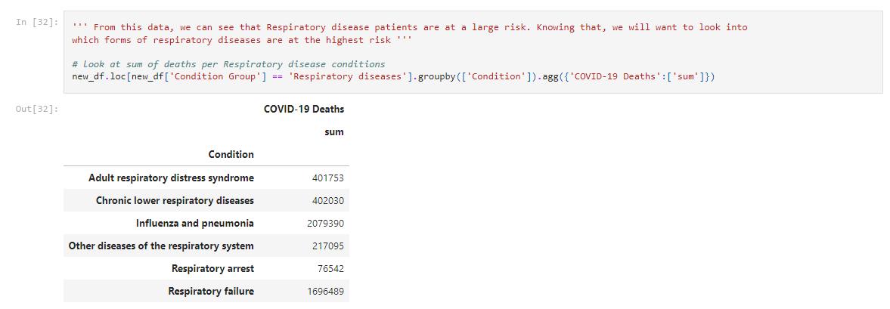
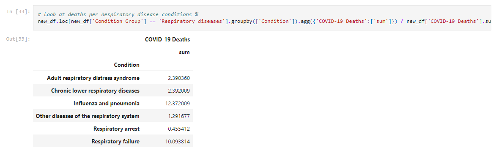
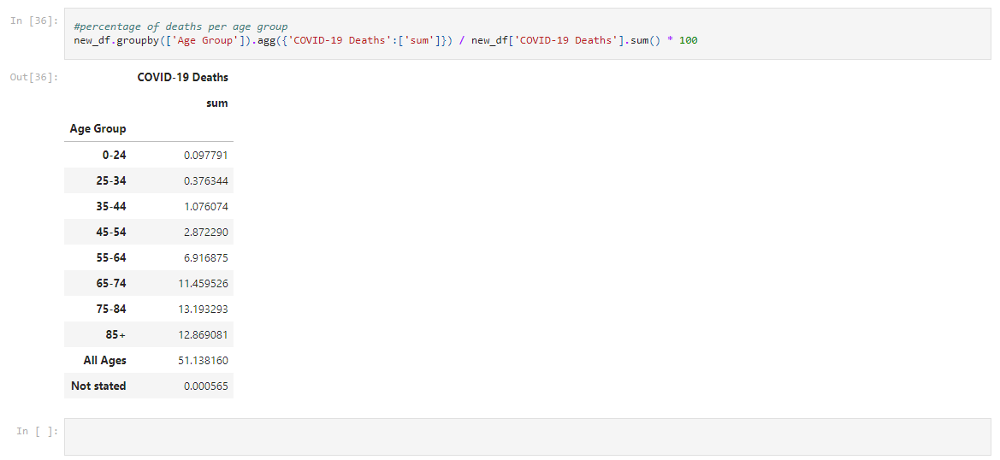

# **Covid-19 Underlying Conditions Project**

In this project we will be analyzing Covid-19 underlying conditions and risk factors. The main questions we want to answer in this project are as follows:

1. What condtion groups are most vulnerable?
2. Which subsection of said condition group is most vulnerable?
3. What are the risk percentages of each age group?

## **Cleaning the Data with Python**

Importing the csv in Jupyter Notebooks  

Removing rows we won't be using  

Dealing with null values

Standardizing Data Types  

## **Analyzing the Data with Python**

Getting a sum of deaths per condition group  

Creating a sum percentage of deaths per condition group  

Looking at respiratory conditions because it is our leading condition group for deaths  

Breaking down respiratory groups by percentage to easily identify leading risk groups 

Taking a look at what age groups are at risk by percent of total  

## **Visualizing the Data with Power BI**

Power bi Covid-19 risks of underlying diseases dashboard  

## **Methods Used**

-Data Analysis  
-Data Visualization  
-Predictive Modeling  
-Data Cleaning  

## **Technologies**

-Python  
-Jupyter Notebooks  
-Power BI  
-Google Sheets  
-Version Control  
