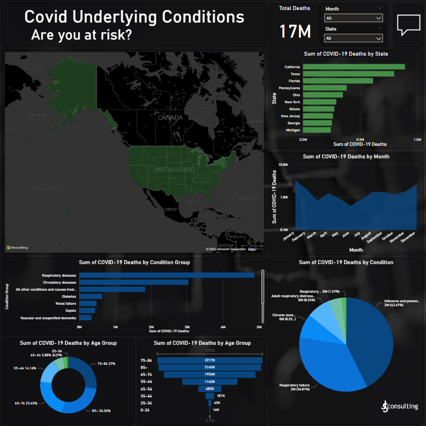

# **Covid-19 Underlying Conditions Project**

In this project we will be analyzing Covid-19 underlying conditions and risk factors. The main questions we want to anser in this project are as follows:

1. What condtion groups are most vulnderable?
2. Which subsection of said condition group is most vulerable?
3. What are the risk percentages of each age group?

## **Cleaning the Data with Python**

Importing the csv in Jupyter Notebooks  

Removing rows we won't be using  

Dealing with null values  

Standardizing Data Types  

## **Analyzing the Data with Python**

Getting a sum of deaths per condition group  

Creating a sum percentage of deaths per condition group  

Looking at respiratory because it is our leading condition catagory for deaths  

Breaking respiratory by percent to easily identify leading causes  

Taking a look at what age groups are at risk by percent of total  

## **Visualizing the Data with Power BI**

Power bi Covid-19 risks of underlying diseases dashboard  

## **Methods Used**

-Data Analysis  
-Data Visualization  
-Predictive Modeling  
-Data Cleaning  

## **Technologies**

-Python  
-Jupyter Notebooks  
-Power BI  
-Google Sheets  
-Version Control  
